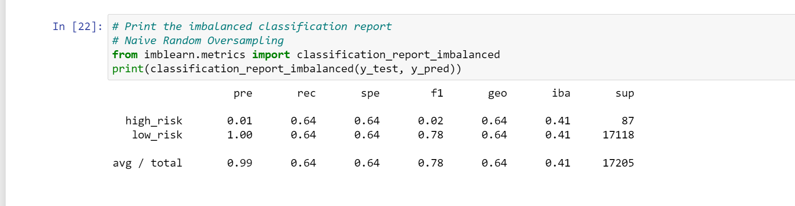
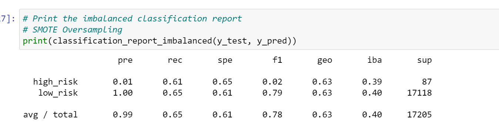
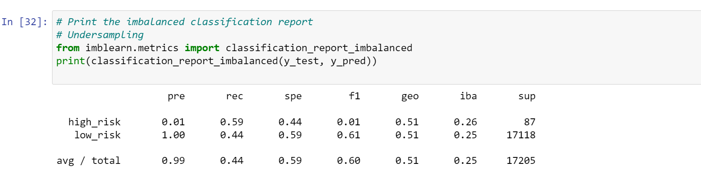
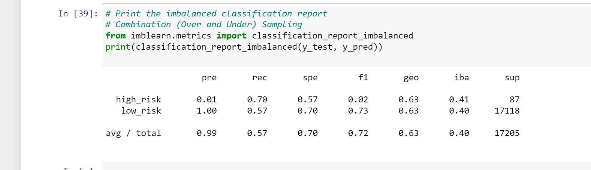
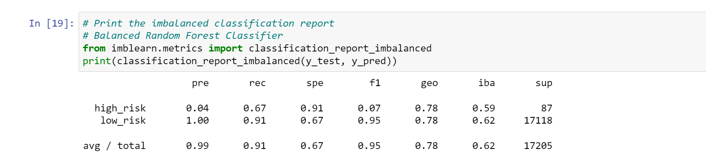
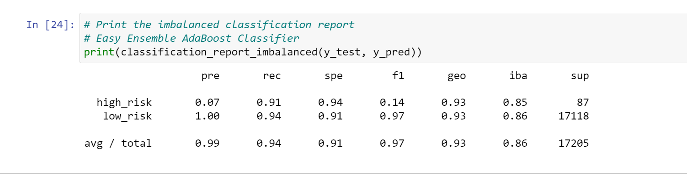

# Credit_Risk_Analysis
## Overview of the Project

Credit risk is an inherently unbalanced classification problem, as good loans easily outnumber risky loans. So, need to employ different techniques to train and evaluate models with unbalanced classes.

Therefore, various libraries and algorithms were used to build and evaluate models using resampling like imbalanced-learn; scikitlearn; RandomOverSampler; SMOTE; ClusterCentroids; SMOTEENN; BalancedRandomForestClassifier; EasyEnsembleClassifier (bias reduction models).

## Results

The results for all the six machine learning models with its respective balanced accuracy,precision,and recall scores are as follows:
For Deliverable 1 ,created training and targeted variables and used LogisticRegression classifier to make predictions and evaluated the model's performance ,calculated the accuracy score;generated a confusion matrix and an imbalanced classification report.

    ### Naive Random Oversampling
   
  
    
    
   Balanced Accuracy : 0.6434595968752392
   
   Precision : Precision low for high risk loans and high for Low-risk loans.
   
   Recall : 0.64/0.64
   
   ### SMOTE Oversampling
   
   
   
   Balanced Accuracy : 0.6295480458158583
    
   Precision : Precision low for high risk loans and high for Low-risk loans.
   
   Recall : 0.61/0.65
   
   
   ### Undersampling
   
   
   
   
   Balanced Accuracy : 0.6295480458158583
    
   Precision : Precision low for high risk loans and high for Low-risk loans.
   
   Recall : 0.59/0.44
   
   
   ### Combination Over and Under Sampling
   
   
   
   
   Balanced Accuracy : 0.5107398543980726
    
   Precision : Precision low for high risk loans and high for Low-risk loans.
   
   Recall : 0.70/0.57
   
   
   ### Balanced Random Forest Classifier
   
   
   
   
   
   Balanced Accuracy : 0.7877672625306695
    
   Precision : Precision low for high risk loans and high for Low-risk loans.
   
   Recall : 0.67/0.91
   
   
   ### Easy Ensemble AdaBoost Classifier
   
   
   
   Balanced Accuracy : 0.925427358175101
    
   Precision : Precision low for high risk loans and high for Low-risk loans.
   
   Recall : 0.91/0.94
   
   
 ## Summary
 
After eavluating all models,utilizing Easy Ensemble Classifier,is the most effective,which provided highest score for risk loans. Regarding balanced accuracy,the highest compared accuracy between 0 and 1  and is closest to 1 is the best machine learning model. From this credit data set ,Easy Ensemble classifier is the best model to choose with its 0.93 balanced accuracy. The other models were below 0.90 balanced accuracy. The precision for all models were similar with an appropriate range. The Easy Ensemble has the highest recall score which is close to 1 being the better model.
   
   
   

   
